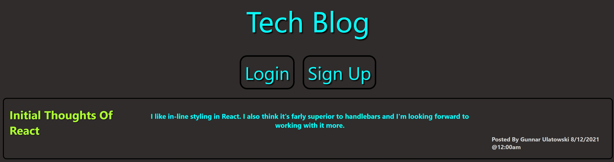

# MVC-tech-blog

      
  # Table Of Contents
  
  [Description](##Description)  
  [Getting Started](##Dependencies)  
  [Usage](##Usage)  
  [Authors](##Authors)  
  [Licensing](##License)  
  [Questions](##Questions)  
  
  
  ## Description
      
 A CMS-style blog site that people can use to publish articles, blog posts, along with their thoughts and opinions once logged in
      
  ## Getting Started
      
  ### Dependencies/Prerequisites
      
  inquirer, understanding of MVC, Sequelize, Handlebars.js 
      
  ### Usage
      
  run nodemon server.js from your terminal to start app or open
      
  ## Authors
      
  Gunnar Ulatowski
      

  ## License
    
  This project is licensed under the MIT  - see the LICENSE.md file for details
  
  
  ## Questions
      
  How To contact me?
  
  Link to my Github: https://github.com/sushistarlove

  Link to my linkedin: https://www.linkedin.com/in/gunnarulatowski/
  
  Email Me!: gunnarulatowski@outlook.com